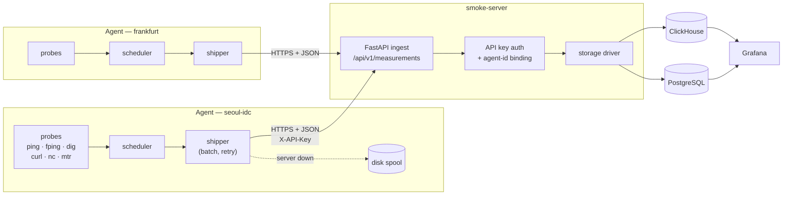

# smokeping-py

A modern, Python 3.11+ reimplementation of [Tobias Oetiker's SmokePing](https://oss.oetiker.ch/smokeping/),
split into a lightweight **agent** and a central **server** (the Zabbix model),
storing into **ClickHouse** or **PostgreSQL**, and visualised entirely in **Grafana**.

It keeps the idea that made SmokePing great — plot the *distribution* of latency
over time, not just an average — and fixes the thing that limits it: the original
throws away almost everything except the number.

---

## Why not just run SmokePing?

The original stores round-trip times into RRD files and little else. That is enough
to see that something is slow, and almost never enough to see *why*. This version
records the context alongside every measurement:

| | SmokePing | smokeping-py |
|---|---|---|
| Latency samples | median + smoke band in RRD | every individual RTT, plus precomputed min/p25/median/p75/p95/max/jitter |
| Which IP answered | not stored | `resolved_ip` on every measurement |
| HTTP detail | total time only | status, final URL after redirects, edge IP, HTTP version, and a DNS → TCP → TLS → server → transfer timing breakdown |
| DNS detail | query time only | responding resolver IP, A/AAAA answers, CNAME chain, TTLs, `aa`/`tc`/`ra` flags, response status |
| Path detail | separate tool | every mtr hop's IP, loss and best/avg/worst/stddev, plus a `path_signature` for route-change detection |
| Vantage point | one host | `agent_location` + arbitrary tags on every row |
| Failures | a gap in the graph | stored, with a canonical `error_type` and the tool's own message |
| Storage | RRD | ClickHouse or PostgreSQL, queryable with SQL |
| Visualisation | built-in CGI | Grafana |

The two questions this is built to answer are *"which IP is slow?"* and
*"where is it slow from?"*. Both need data the original does not keep.

---

## Architecture



**smoke-agent** runs probes on a schedule from one vantage point and ships results.
It is stateless apart from its config file and its spool directory. Linux is the
primary target; Windows is supported (see [Platform support](#platform-support)).

**smoke-server** authenticates, validates and stores. It has no UI by design —
Grafana reads the database directly.

### The failure contract

This is the part worth understanding before you deploy anything:

* Ingest is **synchronous**. The server responds only after the storage driver has
  confirmed the write.
* A storage failure returns **503**, and the agent spools the batch to disk and
  retries later.
* A malformed payload returns **400**, and the agent **drops** it rather than
  retrying a poison batch forever.

A latency monitor is most valuable exactly when the network is broken — which is
exactly when the agent cannot reach the server. The spool is what stops an outage
from erasing its own evidence.

---

## Quick start (Docker Compose)

```bash
cp .env.example .env
```

Edit `.env` and set `SMOKE_API_KEY` to something long and random, then:

```bash
docker compose up -d
```

That brings up ClickHouse, smoke-server, one smoke-agent probing public targets,
and Grafana with the dashboards already provisioned.

* Grafana — <http://localhost:3000> (`admin` / whatever you set as `GRAFANA_PASSWORD`)
* Ingest health — <http://localhost:8080/healthz>
* Ingest metrics — <http://localhost:8080/metrics>

Give it a minute or two for the first cycles to land, then open
**SmokePing → SmokePing — Overview**.

To use PostgreSQL instead:

```bash
docker compose -f docker-compose.yml -f docker-compose.postgres.yml up -d
```

Generate a proper API key:

```bash
docker compose run --rm smoke-server genkey --label seoul-idc
```

---

## Installation without Docker

Python 3.11 or newer.

```bash
pip install "smokeping-py[server,clickhouse]"   # server, ClickHouse backend
pip install "smokeping-py[server,postgres]"     # server, PostgreSQL backend
pip install smokeping-py                        # agent only
```

From a checkout:

```bash
pip install -e ".[all]"
```

The agent shells out to the system binaries for most probes:

```bash
# Debian / Ubuntu
sudo apt install iputils-ping fping dnsutils curl mtr-tiny

# RHEL / Rocky
sudo dnf install iputils fping bind-utils curl mtr
```

The `nc` probe needs nothing installed — it is implemented natively on asyncio.

Check what is available on a host:

```bash
smoke-agent probes
```

---

## Configuration

Both daemons read YAML or TOML (chosen by file extension). String values support
shell-style environment interpolation:

```yaml
api_key: ${SMOKE_API_KEY}                 # required, hard error if unset
url: ${SMOKE_SERVER_URL:-http://localhost:8080}   # with a default
```

A referenced variable that is unset **and** has no default is a startup error
rather than an empty string — a blank API key that "works" until the first
request is much worse than a crash.

Full annotated examples: [`config/agent.example.yaml`](config/agent.example.yaml)
and [`config/server.example.yaml`](config/server.example.yaml).

### Agent

```yaml
agent:
  id: seoul-idc-01           # stable and unique; defaults to the hostname
  location: seoul-idc        # the vantage point — every dashboard groups by this
  tags: { region: kr, isp: kt }

server:
  url: https://smoke.example.com
  api_key: ${SMOKE_API_KEY}
  spool_dir: /var/lib/smoke-agent/spool    # strongly recommended

targets:
  - name: kr
    probe: ping              # inherited by everything below
    interval: 60
    children:
      - name: kt-dns
        host: 168.126.63.1
      - name: naver
        host: https://www.naver.com
        probe: curl          # override
        options: { expect_status: [200] }
      - name: upstream
        host: 203.0.113.1
        probes: [ping, mtr]  # one target, two measurements
        mtr: { count: 10 }   # per-probe options for a multi-probe target
```

The target tree mirrors SmokePing's `Targets` section. Nesting builds the
`target_group` path (`/kr/kt-dns`), and `probe`, `interval` and `options` are
inherited by children unless overridden. Any node with a `host` becomes a measured
target — including intermediate nodes, exactly as in SmokePing.

Option precedence, lowest first:

```
probe class defaults  →  probe_defaults:  →  ancestor options:  →  target options:
```

Validate before restarting anything:

```bash
smoke-agent check -c /etc/smokeping/agent.yaml
```

`check` exits `0` when everything is fine, `1` when a configured probe's binary is
missing (a warning — the other targets still work), and `2` on a config error.

Measure one target once and print everything about it, shipping nothing:

```bash
smoke-agent test -c agent.yaml --target /kr/kt-dns#ping
smoke-agent test -c agent.yaml --probe curl --host https://example.com -o count=3
```

### Server

```yaml
http:
  host: 0.0.0.0
  port: 8080

auth:
  keys:
    - label: seoul-idc
      key_sha256: ${SMOKE_KEY_SEOUL_SHA256}   # the file never holds a live secret
      agent_ids: ["seoul-idc-01"]             # bind the key to its agent

storage:
  driver: clickhouse
  clickhouse:
    url: http://clickhouse:8123
    database: smokeping
    retention_days: 90
```

`agent_ids` is worth setting properly. A wildcard key lets any agent that holds it
write measurements attributed to any location — and the location is the entire
value of the data. Binding each key to its own agent means a compromised edge box
cannot forge results that look like they came from somewhere else.

---

## Probes

| probe | binary | records |
|---|---|---|
| `ping` | `ping` | per-packet RTTs, loss, TTL, resolved IP |
| `fping` | `fping` | same, but **batched**: one process measures every target in the cycle |
| `dig` | `dig` | query time per attempt, **responding resolver IP**, A/AAAA answers, CNAME chain, TTLs, header flags (`aa`/`tc`/`ra`/`ad`), response status, transport |
| `curl` | `curl` | **full timing breakdown**, HTTP status, **edge IP**, final URL after redirects, HTTP version, TLS verify result, transfer sizes |
| `nc` / `tcp` / `udp` | *(none)* | TCP handshake time or UDP round trip, peer address, service banner |
| `mtr` | `mtr` | **every hop's** IP, loss and best/avg/worst/stddev, destination IP, `path_signature` |

Common options for every probe: `count`, `interval`, `timeout`, `ip_version`,
`source`. See the example config for the per-probe ones.

### Notes on individual probes

**`fping` is the one to use at scale.** It implements the batch interface: the
scheduler groups every fping target that shares an interval and options into a
single process. Three hundred targets become one `fping` invocation per cycle
rather than three hundred `ping` processes. Hostnames are resolved by the agent
before invoking it, so `resolved_ip` is exact and the output maps unambiguously
back to targets even when two targets share an address.

**`curl` uses `-w '%{json}'`** (curl 7.70+) with a `%{stderr}` prefix, so the report
lands on stderr and the response body stays on stdout. Older curl builds fall back
to an explicit `key=value` write-out format automatically. The `resolve` option
pins a hostname to an address (`["example.com:443:1.2.3.4"]`), which is how you
compare individual CDN edges from a single vantage point.

**`dig` issues all `count` queries from one process** — dig accepts several queries
per invocation — so you get a real latency distribution for one fork. For DNS,
`resolved_ip` is the *resolver that answered*, not the address in the answer:
8.8.8.8 is dozens of machines, and that column is the only way to see one bad PoP.
The answered addresses are in `details.answer_ips`.

One caveat: BIND's `dig` reports query time in whole milliseconds, so a
sub-millisecond answer from a local cache genuinely records as `0 ms`. That is
dig's resolution, not a parsing bug — use the `nc` probe against port 53 if you
need finer timing of a nearby resolver.

**`nc` is implemented natively on asyncio** rather than shelling out to netcat.
`nc` is not installed by default on Windows, comes in three incompatible flavours
on Linux, and adds 5–15 ms of fork/exec noise to a measurement meant to be accurate
to the millisecond. The native socket also gives us the peer address, the handshake
time and the banner with no output parsing. UDP requires a `payload`, because a
silent port is indistinguishable from a filtered one.

**`mtr` needs raw-socket privileges.** Distribution packages ship it setuid or with
`cap_net_raw`, which is enough. In the provided Docker image the capability is set
on the binaries as a *file* capability, so the agent process itself stays
unprivileged. If your runtime strips file capabilities, add `cap_add: [NET_RAW]`
to the container.

### Reading mtr data correctly

**`path_complete` is not "the last hop replied".** The agent resolves the target
before running mtr and compares the last hop's address against it. When a trace
runs out of TTL (`max_hops`) or the target black-holes ICMP, the final row of an
mtr table is just some transit router — and reporting *its* latency as the
target's would attribute the problem to an innocent hop. In that case the
measurement is recorded as `unreachable`, `latency_ms` and the `destination_*`
fields are left null, `truncated_at_max_hops` says whether `max_hops` was the
cause, and `last_responding_ip` records how far the traffic actually got. The
full hop table is stored either way. `resolved_ip` is always the address you were
aiming at, so per-IP dashboards never group by a transit hop.

The `worst_hop` field is precomputed at ingest, and it deliberately does not just
pick the highest loss. A router that rate-limits ICMP TTL-exceeded replies shows
high loss — often 100% — while forwarding traffic perfectly; the giveaway is that
later hops show *less* loss than it does. Genuine loss propagates: every hop after
it inherits at least as much. So a hop only counts as the culprit when the minimum
loss downstream is at least as high as its own.

`path_signature` is a stable hash of the responding hops, with silent (`???`) hops
excluded so ordinary rate limiting cannot create phantom route flaps. Graph it as
a discrete value and a real reroute becomes a visible step change.

### Writing your own probe

Drop a file into any directory listed in `plugin_dirs`:

```python
# /etc/smokeping/probes.d/synthetic.py
from smokeagent.probes.base import Probe, ProbeTarget, register_probe
from smokecommon.models import ProbeResult

@register_probe
class SyntheticProbe(Probe):
    name = "synthetic"
    required_binary = None            # or "mytool" for a preflight check
    description = "what this measures"
    default_options = {"timeout": 5.0, "threshold": 100}

    def validate(self) -> None:       # called once at startup
        super().validate()
        if self.options["threshold"] < 0:
            raise ValueError("synthetic: threshold must be >= 0")

    async def probe(self, target: ProbeTarget) -> ProbeResult:
        return ProbeResult(
            success=True,
            rtts_ms=[1.23, 1.31],
            packets_sent=2,
            packets_received=2,
            resolved_ip="203.0.113.1",
            details={"anything": "you like — stored as JSON"},
        )
```

No packaging step, no restart of anything but the agent. Probes published by
installed packages via the `smokeping.probes` entry point are picked up too.
Everything else — scheduling, retries, batching, shipping, storage — is handled
for you, and a probe that raises is contained: it records an `internal` failure
rather than killing the scheduler.

---

## Data model

Two tables, identical in both backends.

### `measurements` — one row per probe cycle

| column | notes |
|---|---|
| `ts`, `id` | timestamp and unique id (`(ts, id)` is the PK in PostgreSQL) |
| `agent_id`, `agent_location`, `agent_tags` | **the vantage point** |
| `target_name`, `target_group`, `target`, `probe` | what was measured |
| `success`, `error_type`, `error_message` | failures are rows, not gaps |
| `latency_ms` | representative value (median of the samples) |
| `rtts_ms` | **every individual sample** — reproduces the smoke graph exactly |
| `rtt_min_ms` … `rtt_p95_ms`, `jitter_ms` | precomputed so dashboards need not unnest |
| `packets_sent`, `packets_received`, `loss_pct` | |
| `resolved_ip`, `ip_family` | **the address actually talked to** |
| `duration_ms` | wall-clock cost of the probe itself |
| `details` | probe-specific JSON |

### `mtr_hops` — one row per hop per cycle

`ts`, `measurement_id`, the agent/target identity, then `hop_no`, `hop_ip`,
`hop_host`, `asn`, `loss_pct`, `sent`, `received`, `last_ms`, `avg_ms`, `best_ms`,
`worst_ms`, `stddev_ms`, `is_destination`, `path_signature`.

Hops get their own table because per-hop analysis is a completely different query
shape — you group by hop IP across thousands of cycles — and unnesting an array on
every query would make the panels unusable.

### Views

`ensure_schema` also creates `v_curl`, `v_dig`, `v_mtr` and `v_ip_performance`,
which project the probe-specific `details` JSON into real columns. They cost
nothing (both engines expand them at query time, and the indexes still apply) and
they keep the base table generic while giving Grafana something concrete to point at.

### Applying the schema

The server applies it at startup when `storage.ensure_schema: true`. Otherwise:

```bash
smoke-server migrate -c server.yaml            # apply now
smoke-server schema --driver clickhouse        # print the DDL
smoke-server schema --driver postgresql
```

Pre-generated copies live in [`deploy/clickhouse/initdb/01-schema.sql`](deploy/clickhouse/initdb/01-schema.sql)
and [`deploy/postgres/initdb/01-schema.sql`](deploy/postgres/initdb/01-schema.sql).
A test asserts they match what the drivers actually write, so they cannot go stale.

### Retention

ClickHouse uses a `TTL` clause generated from `retention_days`. PostgreSQL has no
TTL, so `ensure_schema` installs a function instead:

```sql
SELECT smokeping_purge(90);
```

Schedule it from cron or pg_cron:

```sql
SELECT cron.schedule('smokeping-purge', '0 3 * * *', $$SELECT smokeping_purge(90)$$);
```

### Example queries

The smoke graph — a true distribution, not a summary of summaries:

```sql
-- ClickHouse
SELECT
    toStartOfInterval(ts, INTERVAL 1 MINUTE) AS t,
    quantile(0.25)(rtt) AS p25,
    quantile(0.50)(rtt) AS median,
    quantile(0.75)(rtt) AS p75
FROM smokeping.measurements
ARRAY JOIN rtts_ms AS rtt
WHERE ts > now() - INTERVAL 6 HOUR AND target_name = 'kt-dns'
GROUP BY t ORDER BY t;
```

Which endpoint IP is slow:

```sql
SELECT resolved_ip,
       count()                              AS samples,
       round(quantile(0.95)(latency_ms), 2) AS p95_ms,
       round(avg(loss_pct), 2)              AS loss_pct
FROM smokeping.measurements
WHERE ts > now() - INTERVAL 1 DAY AND target_name = 'naver'
GROUP BY resolved_ip
ORDER BY p95_ms DESC;
```

Where does it look bad from:

```sql
SELECT agent_location,
       round(quantile(0.50)(latency_ms), 2) AS median_ms,
       round(quantile(0.95)(latency_ms), 2) AS p95_ms
FROM smokeping.measurements
WHERE ts > now() - INTERVAL 1 DAY AND target_name = 'google-dns'
GROUP BY agent_location
ORDER BY p95_ms DESC;
```

Has a route changed?

```sql
SELECT path_signature, min(ts) AS first_seen, max(ts) AS last_seen, uniq(measurement_id) AS cycles
FROM smokeping.mtr_hops
WHERE ts > now() - INTERVAL 1 DAY AND target_name = 'to-google-dns'
GROUP BY path_signature
ORDER BY first_seen;
```

The PostgreSQL equivalents are the same queries with `unnest(rtts_ms)` instead of
`ARRAY JOIN`, `percentile_cont(0.95) WITHIN GROUP (ORDER BY latency_ms)` instead
of `quantile(...)`, `date_trunc` instead of `toStartOfInterval`, and `now() -
interval '1 day'` for the time bound.

---

## Grafana

Provisioning lives in [`deploy/grafana/`](deploy/grafana/) and is mounted by
Compose automatically. To install by hand: point a file provider at
`deploy/grafana/dashboards/`, or import the JSON through the UI.

Datasources are provisioned with fixed UIDs (`smokeping-clickhouse`,
`smokeping-postgres`) because the dashboards reference them by UID. The ClickHouse
dashboards need the `grafana-clickhouse-datasource` plugin, which the Compose file
installs.

**SmokePing — Overview** covers the four required views:

* the **smoke graph**, built by unnesting `rtts_ms` so the bands are a real
  distribution — min–max shaded, interquartile darker, median as a line;
* **success rate**, packet loss, and failures broken down by `error_type`;
* **per-endpoint-IP comparison** — a time series and a table sorted by p95, so a
  single degraded CDN edge or anycast PoP surfaces instead of being averaged away;
* **per-vantage-point comparison** — the same target from every `agent_location`;
* HTTP timing breakdown and DNS-by-responding-server panels, plus a table of every
  A/AAAA record observed per name (a record silently repointed shows up as a new row).

**SmokePing — Path analysis (mtr)** covers per-hop visualisation: the current path
as a familiar mtr table, latency and loss per hop over time, a hop/time heatmap,
and route-stability panels driven by `path_signature`.

If a panel shows "no data" after import, check the query's format in the panel
editor — the ClickHouse plugin's numeric `format` field has changed across major
versions, and the shipped JSON targets the v4 encoding.

---

## Operations

### Command reference

```
smoke-agent run    -c agent.yaml     # default
smoke-agent check  -c agent.yaml     # validate config; 0 ok / 1 warnings / 2 error
smoke-agent test   -c agent.yaml --target /kr/kt-dns#ping
smoke-agent probes                   # list probes and whether their binary exists

smoke-server run     -c server.yaml  # default
smoke-server check   -c server.yaml
smoke-server migrate -c server.yaml  # apply the schema
smoke-server schema  --driver clickhouse|postgresql
smoke-server genkey  --label seoul-idc
```

### Endpoints

| endpoint | auth | purpose |
|---|---|---|
| `POST /api/v1/measurements` | yes | ingest |
| `GET /healthz` | no | liveness — deliberately never touches the database |
| `GET /readyz` | no | readiness — pings the storage driver |
| `GET /metrics` | no | Prometheus text exposition |
| `GET /api/v1/info` | no | version, protocol version, active driver |
| `GET /api/v1/agents` | yes | agents seen in the last 24 h |

Use `/healthz` for the orchestrator's liveness probe and `/readyz` for load-balancer
readiness. A database blip should not make Kubernetes restart a perfectly healthy
server.

### Logging

Structured JSON on stdout, one object per event. Anything passed as a log field
becomes a top-level key, and a `request_id` is bound to every HTTP request:

```json
{"ts":"2026-07-25T12:00:00.123+00:00","level":"INFO","service":"smoke-server",
 "logger":"smokeserver.app","message":"ingested batch","agent_id":"seoul-idc-01",
 "agent_location":"seoul-idc","measurements":37,"failed_probes":2,"hops":15,
 "write_ms":4.21,"request_id":"a1b2c3d4e5f6"}
```

Use `--log-format text` for a human-readable variant while debugging.

### Sizing

One measurement per target per cycle. 300 targets at 60 s is 5 rows/second —
about 430 k rows/day, which PostgreSQL handles comfortably with the shipped
indexes. Reach for ClickHouse past a few thousand rows/second, or when you want
months of raw (un-downsampled) retention. mtr adds one `mtr_hops` row per hop, so
budget roughly 15× its measurement count.

The agent's cost is dominated by process spawns: prefer `fping` over `ping` for
large target sets, and give `mtr` a much longer interval than everything else
(300 s is reasonable) since it walks the entire path.

### Scaling out

The server is stateless — run several behind a load balancer, all pointed at the
same database. Agents are independent; add a vantage point by deploying another
agent with a new `location` and its own API key.

### Troubleshooting

**`mtr` reports "Failure to start ICMP session: Operation not permitted"** — the
binary lacks `cap_net_raw`. Either `setcap cap_net_raw+ep /usr/bin/mtr-packet`, or
add `cap_add: [NET_RAW]` to the container.

**Agent logs `spooled measurements` repeatedly** — the server is unreachable or
its database is down. Check `GET /readyz` on the server. The data is safe on disk
and replays automatically; watch `spool_max_bytes` if the outage is long.

**Agent logs `server rejected batch permanently, dropping`** — a 400/413/422. Check
the server logs for the reason; usually `max_body_bytes` is too small for the
agent's `batch_max_size`, or the agent is newer than the server (`protocol_version`).

**`smoke-agent check` warns about a missing binary** — install it, or set
`enabled: false` on the targets that use that probe. The other targets keep working.

**Windows ping produces no samples** — it should not; the parser is locale-agnostic
by design. If you hit a locale it cannot read, please open an issue with the raw
output of `ping -n 2 8.8.8.8`.

### Platform support

Linux is the primary target. Windows agents work: `ping`, `dig`, `curl` and
`nc`/`tcp`/`udp` are all supported, and the ping parser handles localised
`ping.exe` output (it keys off the `=`/`<` separator, the digits and the literal
`ms`, since those are the only parts that are never translated). `fping` and `mtr`
have no standard Windows builds, so those probes report `tool_missing` there —
which is a recorded measurement, not a crash.

---

## Security

* Run the ingest endpoint behind TLS. A shared secret in a header is only as
  private as the transport.
* Prefer `key_sha256` over `key` in the server config, so a file that ends up in
  git holds no live secret. `smoke-server genkey` prints both halves.
* Bind every key to its `agent_ids`. See [Server](#server) for why.
* Keys are compared as SHA-256 digests with `hmac.compare_digest`, and *every*
  configured key is checked even after a match, so response time does not leak
  which key matched or how many exist.
* `auth.allow_anonymous` exists for isolated lab networks. It logs a warning at
  startup because it lets anyone who can reach the port write measurements
  attributed to any agent.
* The agent redacts `Authorization`, `Cookie` and similar headers from the curl
  command line it stores in `details.command`.

---

## Development

```bash
python -m venv .venv && . .venv/bin/activate    # .venv\Scripts\activate on Windows
pip install -e ".[all]"

pytest                      # 430+ tests, no network required
pytest --cov=src            # with coverage
ruff check src tests
```

The probes are split into "build the command line" and "parse the output", and the
tests exercise those pure halves against real recorded output from the actual
binaries. That is what makes it possible to test the Windows `ping` parser on Linux
CI and the mtr parser without raw-socket privileges. `tests/test_end_to_end.py`
wires the real scheduler, shipper, HTTP layer and server app together over ASGI —
including the outage-and-replay path — with only the probe and the database
substituted.

Project layout:

```
src/smokecommon/     wire models, structured logging, config loading, subprocess helper
src/smokeagent/      probes/, scheduler, shipper, spool, config, cli
src/smokeserver/     app (FastAPI), auth, config, storage/{clickhouse,postgres}
config/              annotated example configs
deploy/              generated SQL, Grafana provisioning and dashboards, Compose configs
docker/              agent and server Dockerfiles
tests/               pytest suite
```

---

## License

MIT.

`smokeping-py` is an independent reimplementation and is not affiliated with or
endorsed by Tobias Oetiker or the original SmokePing project.
